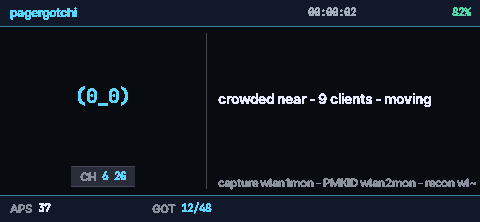
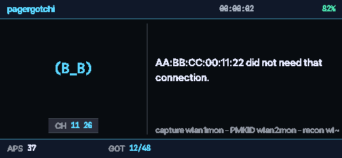
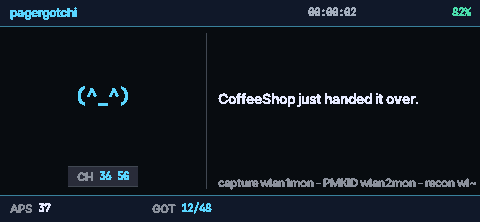
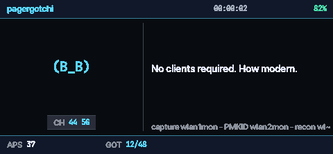
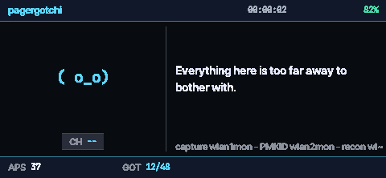
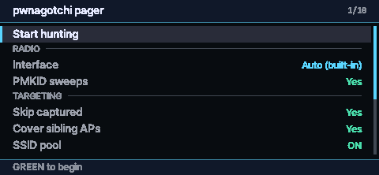
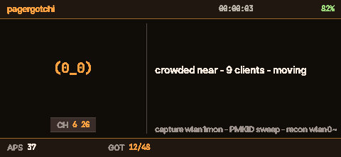
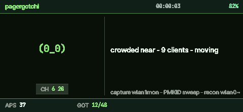
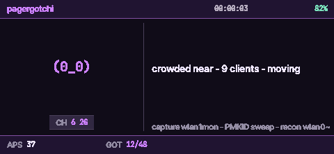

# Pwnagotchi Pager

A pwnagotchi for the Hak5 WiFi Pineapple Pager. Put it in your pocket, and it
hunts WPA handshakes on its own until you take it out again.



It is not a scanner with a cute face on it. It picks its own targets, decides
which attack is worth trying on each one, notices when something is not
working, and changes what it does. Then it stops attacking a network the moment
it has what it needs, and moves on.

## What it can do

**Two attacks at once.** Handshakes come from deauthenticating clients and
catching the reconnect; PMKIDs come from asking the access point directly and
need no clients at all. With an MK7AC plugged in, both run in parallel on
separate radios. With one radio, it alternates. You do not configure any of
this - it works out what hardware it has and uses it.

**It aims.** Rather than blasting broadcast deauth at whatever is loudest, it
learns client addresses from probe requests and targets the specific client it
can hear best. On one street test, five of sixty access points went from
unreachable to capturable this way, every one a distant router whose client was
much closer than it was.

**It knows what is pointless.** A WPA3-only network is never attacked, because
protected management frames make deauth useless. A WPA2/WPA3 network gets a few
tries and then goes to the front of the PMKID queue, which is the route that
actually works there. Channels the radio may listen on but not legally transmit
on - DFS, and all of 6 GHz on the internal radio - are scanned and swept, never
deauthed.

**It knows when to stop.** Captured networks are dropped from the rotation,
tracked by name so every radio of the same router goes with them. An access
point that ignores everything you throw at it is set aside and left to PMKID,
then forgiven later if its clients come back or you start moving.

**It protects what you tell it to.** Whitelist a network and nothing touches
it, including its hidden mesh radios and any differently-named band. The
whitelist always beats the blacklist, and protection sticks even through sweeps
where that network is not heard.

**It tells you what it is doing.** Every state has a face and a line of text.
When it is idle it says why - out of range, everything captured, filtered out
by your own settings - instead of sitting there looking busy.

Working a client off an access point, and a network giving one up:




Going for a PMKID where there are no clients to knock off, and an idle moment
where nothing in range is worth attacking:




## Installing it

You need `python3` and `python3-ctypes`, `hcxdumptool`, `hcxtools` (for
`hcxpcapngtool`), and `libpagerctl.so`, which is bundled in `lib/` or installed
by the PAGERCTL payload.

```sh
scp -r payloads/user/reconnaissance/pwnagotchi_pager \
    root@172.16.52.1:/root/payloads/user/reconnaissance/
```

It appears under Reconnaissance -> Pwnagotchi Pager.

**python3 is not preinstalled** on the Pager, and it has to go on the SD card
because `/overlay` has only about 31 MB free:

```sh
opkg update
opkg -d mmc install python3 python3-ctypes
```

Checking for it over SSH afterwards will lie to you: the SD card is only added
to the path by an interactive login shell, so `ssh pager which python3` reports
not found even when it is installed and working. The payload sets the
environment itself, so this only affects your spot checks.

`hcxdumptool` is often missing from the cached package list. If `opkg install`
cannot find it, grab the `.ipk` matching `opkg print-architecture` from the
OpenWrt feed for your release. Tested against 6.3.4.

While it runs it takes over the radios and the screen: `nginx` and `php8-fpm`
stop, so the web UI is unreachable, the stock pager UI is replaced, and
`pineapd` is restarted with its own arguments. Everything is put back when you
exit through the menu or send it `SIGINT`, `SIGTERM` or `SIGHUP`. After a
`SIGKILL` nothing can run a trap, so restart them yourself:

```sh
/etc/init.d/pineapd start; /etc/init.d/php8-fpm start
/etc/init.d/nginx start;   /etc/init.d/pineapplepager start
```

## Using it

GREEN selects, RED goes back, LEFT/RIGHT changes a value, UP/DOWN moves.

| Field | Meaning |
|---|---|
| header left | unit name |
| header right | uptime, then battery |
| `CH` chip | channel being examined, with band |
| `APS` | APs on this channel / total in range |
| `GOT` | networks captured this session / total known |
| footer right | the most recent capture |
| the dim line | radio layout, clients discovered, and `moving` when you are |

`GOT` counts networks, not files, so extra handshakes for something you already
have do not inflate it. A network only counts once there is a PMKID or a
finished EAPOL pair - a half exchange is kept and stays crackable, but the
network stays in the rotation, because a half exchange never proves the client
and the router actually finished talking.

The startup menu picks the interface, PMKID sweeps, skip-captured, sibling AP
coverage, the whitelist and blacklist editors, AP logging, and the LED,
vibration and sound feedback. The interface line shows what was actually
detected, so `Auto (built-in)` here means no MK7AC is plugged in:



Five themes ship and switch live from the pause menu, so you can pick one that
stays readable in whatever light you are standing in - Ember, Moss and Orchid
below, with Abyss above and Slate rounding it out:





Pausing really pauses. The agent stops between actions, drops its channel lock,
interrupts any sweep in progress and stops the capture, then holds until you
resume. Nothing transmits while the menu is open.

Captures land in `/root/loot/PwnagotchiPager/`. Everything from previous runs
is indexed at startup so it always knows what it already has, and raw captures
that turned out to hold nothing are cleaned up so the folder does not fill with
dead files.

## How it adapts

The interesting part is what happens over time.

It measures traffic as a rate, not a running total, so a router that has merely
been visible for hours is never mistaken for a busy one. It records how many
captures each channel has produced per second of airtime, across every run, and
spends more time on the channels that have actually paid off. It judges whether
deauth or PMKID is working by how long each has gone without a win, not by
whether it has ever had one - so a single lucky capture early does not switch
off the adaptation for the rest of the session.

When only one or two channels are worth visiting, it attacks more access points
on each of them, because every client knocked off the same channel reconnects
into the same listening window. When targets are far away it dwells longer and
tries harder per access point; when they are close and numerous it spreads out
instead. When you start moving, everything shortens.

The signal floor moves as well: plenty of strong targets and it gets pickier,
a couple of idle epochs and it reaches further out rather than sitting still.

## Radios

| Interface | Capture | PMKID | Recon |
|---|---|---|---|
| Auto, MK7AC present | `wlan1mon` | `wlan2mon` | `wlan0mon` |
| Auto, no MK7AC | `wlan1mon` | periodic sweep | `wlan0mon` |
| MK7AC | `wlan2mon` | `wlan1mon` | `wlan0mon` |
| Built-in | `wlan1mon` | periodic sweep | `wlan0mon` |

Plug an MK7AC in mid-run and it is adopted without a restart, converted to
monitor mode if it arrives in managed mode. Pull it out and it falls back to
sweeps. Band and channel lists are read from the driver at runtime and
refreshed every couple of minutes, so enabling a band while it runs is picked
up on its own.

## Configuring it

Almost everything lives in the on-screen menus. `config.conf` holds the few
things worth setting over SSH, and is re-read while running, so an edit lands
within five seconds:

```ini
[general]
debug = false

[capture]
handshakes_dir =
pmkid_sweep_secs =
pmkid_sweep_every_epochs =

[channels]
channels =

[whitelist]
ssids =

[timing]
throttle_d = 0.9
throttle_a = 0.4
```

A blank key is not an empty setting - it means leave this to the adaptive
engine, which is why the sweep timings ship empty. Bad values are logged and
replaced with defaults rather than stopping the payload.

## Known limits

PineAP does not report which client is associated to which access point, so
clients are inferred from probe requests. Anything that has not probed recently
falls back to broadcast deauth. Its recon output carries no encryption field
either, so open networks cannot be filtered out of the target list, though that
does not affect capture.

The SSID pool needs a radio nobody else is using, and a stock Pager does not
have one - the open AP shares a radio with recon. When you switch it on and it
cannot run, the status line says so rather than leaving you guessing.

Nothing here tries to defeat DFS radar protection. Those channels are shared
with weather and aviation radar, and are listened to but never transmitted on.

## Layout

```
pwnagotchi_pager/
  agent.py        the hunt loop
  targeting.py    every targeting decision
  history.py      what each AP has taught us: fatigue, refusals, dead ends
  conditions.py   noise, density, range, stationary / moving
  epoch.py        per-epoch counters and the mood derived from them
  scope.py        what is in and out of scope
  stats.py        per-channel yield, session and lifetime totals
  interfaces.py   radio detection, the capture/PMKID/recon plan, MAC restore
  pineap.py       PineAP control, the AP table, client discovery
  pmkid.py        hcxdumptool: dedicated radio and sweeps
  captures.py     .22000 parsing, the capture index, the AP log
  pool.py         the SSID pool AP and its uci lifecycle
  config.py       one settings source (config.conf + settings.json)
  system.py       host metrics, subprocess helpers, LEDs and buzzer
  voice.py        what it says
  app.py          session lifecycle and the dependency gate
  ui/
    pager.py      framebuffer, input, the C library lock
    look.py       faces, palettes, fonts, regions, wrapping
    screen.py     the HUD and its dirty-region renderer
    menus.py      generic menu widget and every menu
    lists.py      AP and client pickers
```

Fonts are JetBrains Mono and Inter, both SIL OFL 1.1; see `fonts/README.md`.


A word of acknowledgement. This repo was started as a bug fix and feature add to https://github.com/pineapple-pager-projects/pineapple_pager_pagergotchi. However, given the divergence in approach, the near total rewrite and the large amount of features added, it seemed prudent to break it off into it's own project. All that said, I just wanted to acknowledge the inspiration and beginnings of the idea.

NOTE: This is an academic project and is NOT intended to be used in any illegal manner. Know your local laws and be certain to adhere to them. I make no claims of legality in use. YOU are responsible for using this.
